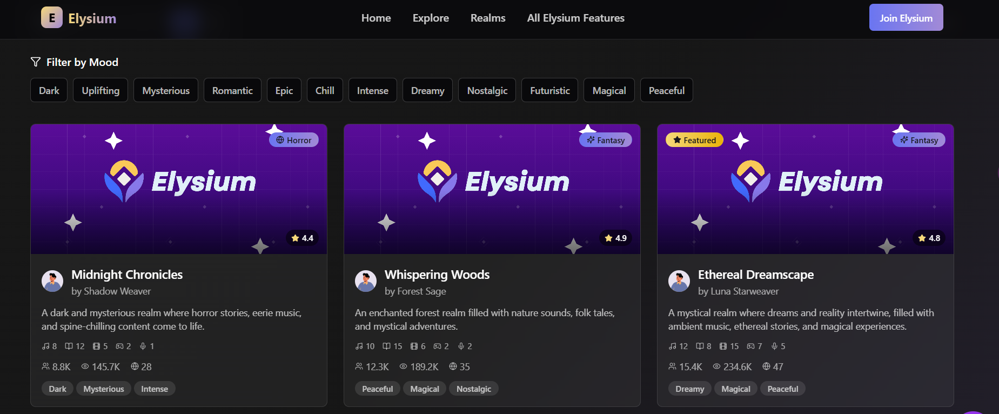
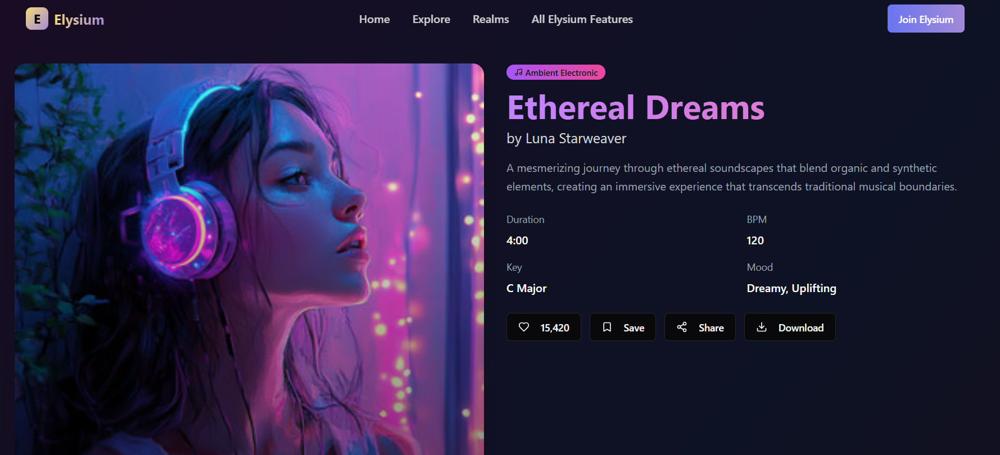
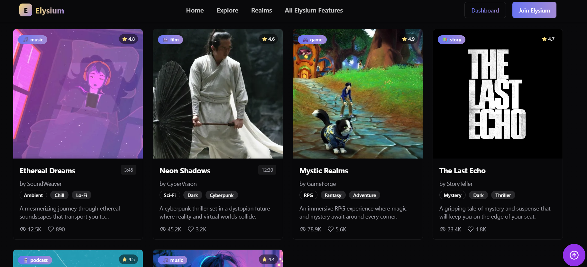
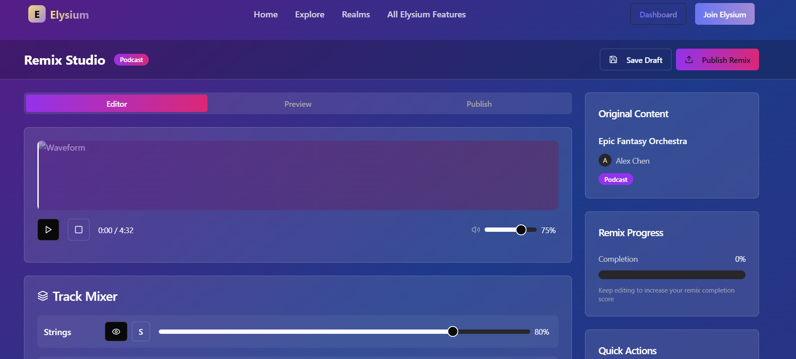
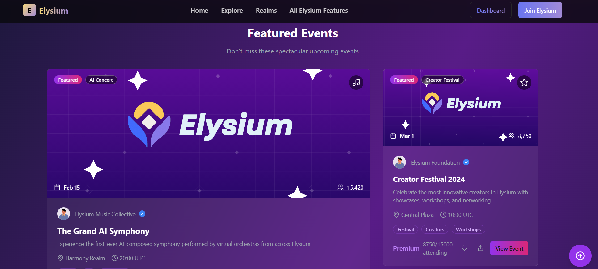
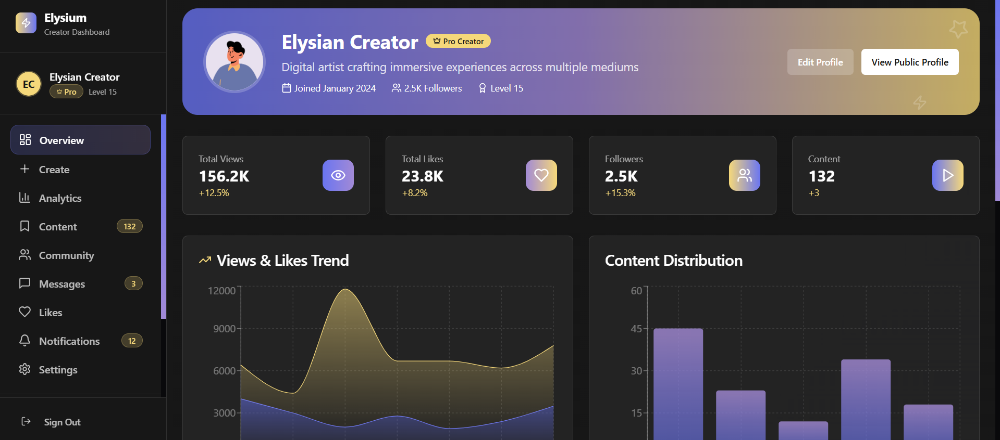

<div align="center">
    <div>
        
    </div>
    <div>
            <h3><b>Elysium</b></h3>
            <p><i>Where Imagination Becomes Entertainment</i></p>
    </div>      
</div>
<br>
<h1 align="center">Elysium - United Hacks V5 Hackathon</h1>
<div align="center">


</div>
<br>
<b>Elysium</b> is a visionary entertainment universe where creativity meets interactivity. Users can create, remix, explore, and engage with immersive content—ranging from AI-generated music, films, games, and stories—all inside a boundless platform where entertainment is no longer passive, but co-created and alive. Elysium is built to push the limits of what's possible in the entertainment industry using AI, beautiful UI, and seamless social interaction.

---

## 📃 Table of Contents
- [Complete Documentation](#-complete-documentation)
- [Technology Stack](#-technology-stack)
- [Core Features](#-core-features)
- [Live Demo](#-live-demo)
- [Getting Started Locally](#-getting-started-locally)
- [env Configuration](#-env-configuration)
- [Website Preview](#-website-preview)
- [Diagram](#-diagram)
- [Owner](#-owner)
- [Contact](#-contact)

---

## 📚 Complete Documentation

<ul>
    <li><b>Notion Documentation (Full Details)</b></li>
    <a href="https://stanley-n-wijaya.notion.site/Elysium-Documentation-22e73555b71f8064897ad2a95a262a3c?source=copy_link">Elysium Notion Documentation</a>
    <li><b>Canva Pitch Deck</b></li>
    <a href="https://www.canva.com/design/DAGs9MIU-QE/cVH206ZkET2Q4O6v8fYx0Q/edit?utm_content=DAGs9MIU-QE&utm_campaign=designshare&utm_medium=link2&utm_source=sharebutton">Canva Pitch Deck</a>
    <li><b>YouTube Demo Video</b></li>
    <a href="https://youtu.be/B7ezEsK2zAE">YouTube Demo Video</a>
</ul>

---

## ⚙️ Technology Stack

<div align="center">

<kbd></kbd>
<kbd></kbd>
<kbd></kbd>
<kbd></kbd>
<kbd></kbd>
<kbd></kbd>
<kbd></kbd>
<kbd></kbd>
<kbd></kbd>
<kbd></kbd>

</div>

<div align="center">
<h4>React | TypeScript | Vite | Tailwind CSS | Shadcn UI | Supabase | HuggingFace | OpenAI | Python | Cloudinary</h4>
</div>

---

## 🧩 Core Features

### 🎭 Entertainment Universe
- Explore 5 core media: **Music, Film, Podcast, Game, Story**
- Realms: Build and Interact with user-made universe of their contents
- Dive into **Realms**: interactive, story-driven AI worlds
- Mood-based discovery feed: **MoodVerse**

### 🎨 AI Creation Tools
- **AI Story Generator**, **Visual Scene Builder**, **Voice Synthesizer**
- **Music Remixer**, **Character Designer**, and **AI Director Mode**

### 👥 Social & Interactive
- **Echoes** (AI + community-based microblog)
- **Remix Lab** to remix other creators’ work with AI help
- Real-time **Live Events**, **Virtual Concerts**, and **Q&A Shows**

### 📚 Learning & Creator Tools
- **Elysium Academy**: Learn to create, collaborate, and innovate
- **Creator Page**: Monetize content, showcase portfolio, followers
- **Remix Templates** and Creator Collaboration Boards

---

## 🚀 Live Demo

Visit the live deployment of Elysium:  
👉 [https://elysium-snw.vercel.app/](https://elysium-snw.vercel.app/)

---

## 🧰 Getting Started Locally

### Prerequisites
- **Node.js** (v16+)
- **Supabase Account**
- **Cloudinary Account**
- **Git**
- **Python 3.10+ (for Flask AI Server)**

### Clone the Project
```
git clone https://github.com/StyNW7/Elysium.git
cd elysium
cd Client
npm install
npm run dev
```

---

## 🔐 .env Configuration

.env for the Client Side Service
```
VITE_SUPABASE_URL=
VITE_SUPABASE_ANON_KEY=
```

---

## 📸 &nbsp;Website Preview
<table style="width:100%; text-align:center">
    <col width="100%">
    <tr>
        <td width="1%" align="center"></td>
    </tr>
    <tr>
        <td width="1%" align="center">Home Page</td>
    </tr>
    <tr>
        <td width="1%" align="center"></td>
    </tr>
    <tr>
        <td width="1%" align="center">Realms Page</td>
    </tr>
    <tr>
        <td width="1%" align="center"></td>
    </tr>
    <tr>
        <td width="1%" align="center">Content Detail Page</td>
    </tr>
    <tr>
        <td width="1%" align="center"></td>
    </tr>
    <tr>
        <td width="1%" align="center">Explore Page</td>
    </tr>
    <tr>
        <td width="1%" align="center"></td>
    </tr>
    <tr>
        <td width="1%" align="center">Remix Studio Page</td>
    </tr>
    <tr>
        <td width="1%" align="center"></td>
    </tr>
    <tr>
        <td width="1%" align="center">Aether Page</td>
    </tr>
    <tr>
        <td width="1%" align="center"></td>
    </tr>
    <tr>
        <td width="1%" align="center">Elysian's Dashboard Page</td>
    </tr>
</table>

---

## 🧭 Diagram

*Overall Database System Flow:*
<p align="center">
  
</p>

This diagram shows how the models connected using ERD Diagram

---

## 👥 Owner

This Repository is created by
<ul>
<li>Stanley Nathanael Wijaya</li>
</ul>
As Hackathon Project for United Hacks V5

---

## 📬 Contact
Have questions or want to collaborate?

- 📧 Email: stanley.n.wijaya7@gmail.com
- 💬 Discord: `stynw7`

<code>Made with ❤️ by SNW with only 1.5 days</code>